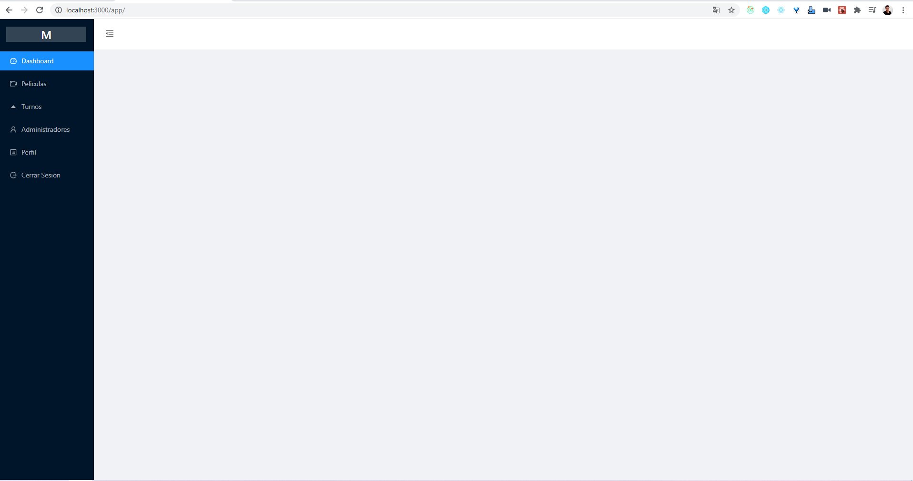
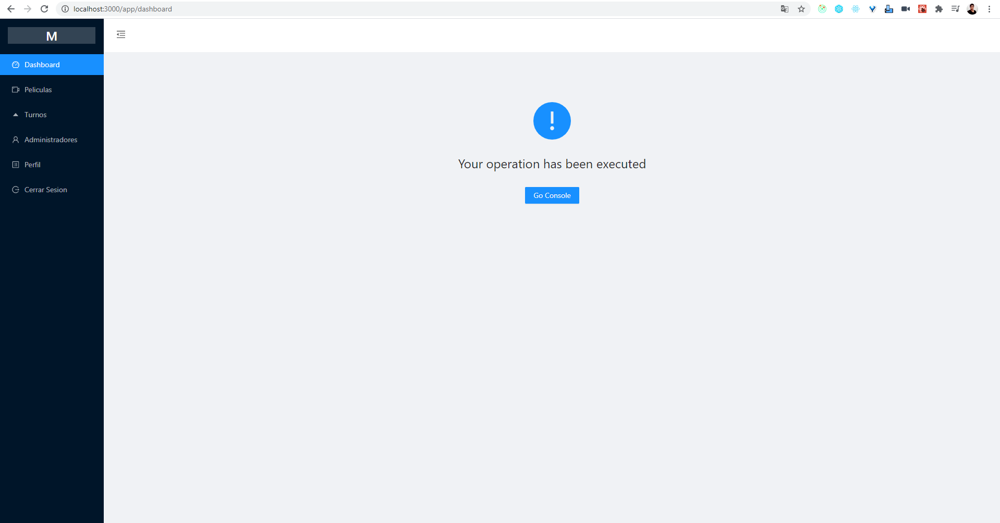
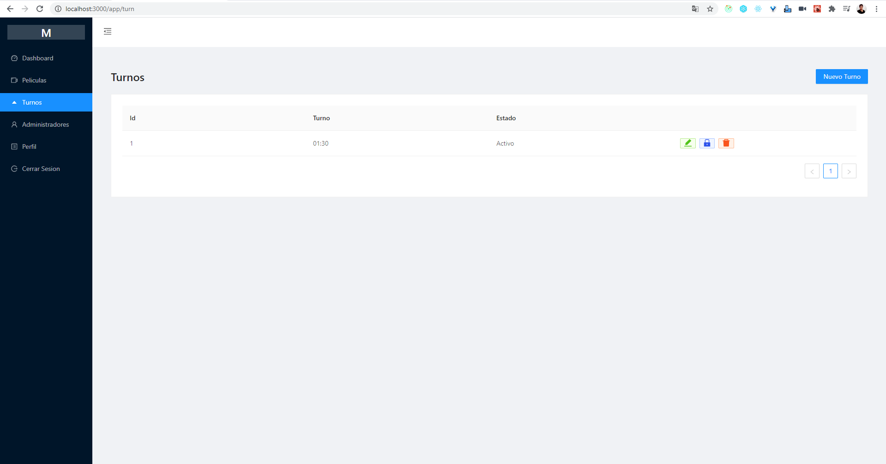
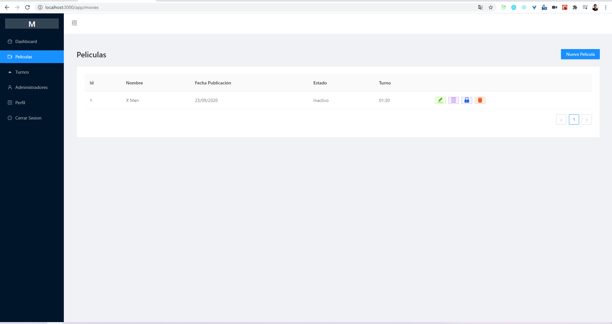

# Respuesta a evaluación tecnica - Front-End Developer

Esta app, describe la solucion al problema planteado, crud peliculas.

Pasos para ejecutar

## exec

* **se necesitan dos terminales, en el root del proyecto**

  > **/home/movies/**

  ### _Client Web_
  el comando de ejecucion:
  ```
   yarn start
  ```
  ### _Server_

  En esta parte he usado [json-server](https://github.com/typicode/json-server).
  El comando de ejecucion:
  ```
  json-server --watch db.json --port 3004
  ```

  una vez iniciado el proyecto la ruta donde se muestran las vistas el la siguiente, 

  > **http://localhost:3000/app/**

## Examples

### **Main**

 

 ###  **No functionality**

 

 ###  **Actions 1**

 

  ###  **Actions 2**

 

 